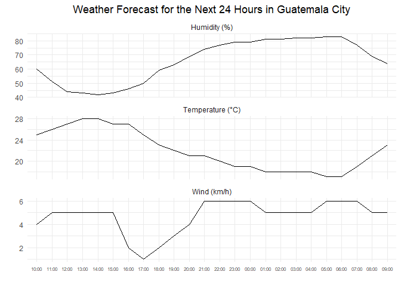
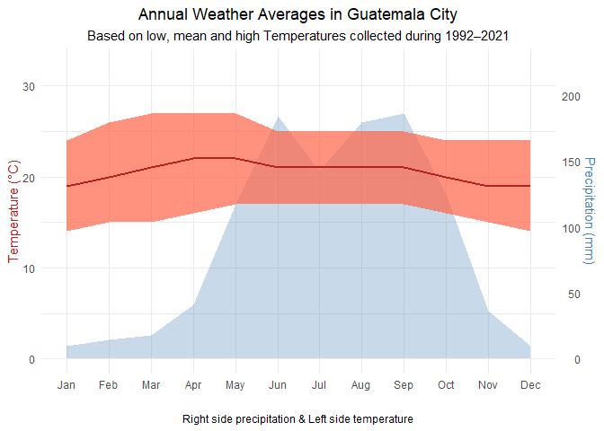

Acquisition and analysis of weather data
================
Georgios Papadopoulos \|
2026-05-10

**Reproducible weather data acquisition workflow in R using web
scraping, data transformation, and visualization techniques.**

## Introduction

This project demonstrates a reproducible weather data acquisition
workflow in R. Weather data for Guatemala City is scraped from
timeanddate.com, cleaned into structured tables, visualized, and
interpreted.

The analysis covers short-term forecasts, hourly weather patterns, and
annual climate averages.

``` r
library(tidyverse)
library(rvest)
library(httr)
```

## Methods

The original workflow uses `httr` and `rvest` for web scraping,
`tidyverse` for data cleaning and transformation, `stringr` for text
extraction, `ggplot2` for visualization and `kableExtra` for formatted
tables.

However, the website later introduced restrictions on automated requests
which resulted in HTTP 403 errors during rendering. To preserve
reproducibility, the source webpages were therefore stored locally as
HTML files and parsed with the same scraping workflow.

## 1. 48-hour weather forecast

The weather page is requested programmatically, parsed as HTML, and
converted into structured tables. The available tables are then
inspected to identify the relevant 48-hour forecast data for further
cleaning and analysis.

``` r
url <- "https://www.timeanddate.com/weather/guatemala/guatemala"
#html <- read_html(GET(url, add_headers(`Accept-Language` = "en")))
html <- read_html("html/forecast_48.html")

tables <- html %>% html_table(fill = TRUE)
cat("The website contains", length(tables), "tables")
```

    ## The website contains 4 tables

After inspecting the extracted HTML tables, the third table was
identified as the relevant 48-hour forecast table. This table is
selected as the source for the following cleaning, restructuring and
analysis steps.

### Data cleaning

The extracted table is first restructured to ensure that variables and
observations are correctly aligned for subsequent analysis.

``` r
forecast_48 <- tables[[3]]
```

The final row contains a source footnote rather than forecast data, so
it is removed from the table.

``` r
forecast_48 <- forecast_48[-nrow(forecast_48), ]
```

Weather icons are not captured during scraping, which creates an empty
intermediate row in the extracted table.

``` r
forecast_48[2, -1] <- forecast_48[4, -1]
forecast_48 <- forecast_48[-4, ]
```

The column structure still requires normalization. This is the current
state:

    ## [1] ""       "Sunday" "Sunday" "Sunday" "Monday" "Monday" "Monday" "Monday"

To create meaningful column names, the **time of day** row is extracted
and combined with the corresponding day labels into a single header row.

``` r
time_row <- as.character(unlist(forecast_48[1, ]))
forecast_48 <- forecast_48[-1, ] 
day_names <- colnames(forecast_48) 

new_names <- paste(day_names, time_row, sep = " ") #combine
new_names[1] <- "Variable"
colnames(forecast_48) <- new_names
```

### Table

``` r
knitr::kable(
  forecast_48,
  caption = "Forecast for the next 48 hours in Guatemala City"
)
```

| Variable | Sunday Morning | Sunday Afternoon | Sunday Evening | Monday Night | Monday Morning | Monday Afternoon | Monday Evening |
|:---|:---|:---|:---|:---|:---|:---|:---|
| Forecast | Passing showers. Overcast. | Passing showers. Overcast. | Passing showers. Overcast. | Passing showers. Cloudy. | Passing showers. Broken clouds. | Passing showers. Cloudy. | Passing showers. Clear. |
| Temperature | 24 °C | 27 °C | 21 °C | 18 °C | 23 °C | 27 °C | 21 °C |
| Feels Like | 25 °C | 27 °C | 21 °C | 18 °C | 25 °C | 27 °C | 21 °C |
| Wind Speed | 4 km/h | 5 km/h | 6 km/h | 5 km/h | 5 km/h | 6 km/h | 5 km/h |
| Wind Direction | NE↑ | E↑ | NNW↑ | N↑ | NE↑ | E↑ | NNW↑ |
| Humidity | 67% | 43% | 74% | 82% | 64% | 44% | 70% |
| Dew Point | 17 °C | 14 °C | 16 °C | 15 °C | 16 °C | 14 °C | 15 °C |
| Visibility | 14 km | 13 km | 11 km | 5 km | 13 km | 12 km | 11 km |
| Probability of Precipitation | 9% | 17% | 35% | 35% | 28% | 15% | 14% |
| Amount of Rain | 0.2 mm | 0.6 mm | 0.6 mm | 0.6 mm | 0.6 mm | 1.3 mm | 0.2 mm |
| Amount of Snow | 0.0 mm | 0.0 mm | 0.0 mm | 0.0 mm | 0.0 mm | 0.0 mm | 0.0 mm |

Forecast for the next 48 hours in Guatemala City

### Insights

The 48-hour forecast for Guatemala City shows stable weather conditions
with no expected rainfall. Temperatures follow a daily cycle, higher in
the afternoon around 26 degrees Celsius and lower at night around 15
degrees Celsius, while humidity increases as temperature decreases. Wind
speeds remain light and fairly constant and conditions are mostly cloudy
throughout.

## 2. Hourly weather forecast

The same scraping workflow is applied to the hourly forecast page, and
the extracted table is stored as `forecast_24` for cleaning,
transformation and visualization.

``` r
url <- "https://www.timeanddate.com/weather/guatemala/guatemala/hourly"
#html <- read_html(GET(url, add_headers("Accept-Language" = "en")))
html <- read_html("html/hourly.html")

tables <- html %>% html_table(fill = TRUE)
forecast_24 <- tables[[1]]
```

### Data cleaning

The first extracted row is reassigned as the column header structure of
the table.

``` r
colnames(forecast_24) <- as.character(unlist(forecast_24[1, ]))
forecast_24 <- forecast_24[-1, ]
```

The footnote contains metadata rather than forecast observations and is
therefore removed.

``` r
forecast_24 <- forecast_24[-nrow(forecast_24), ]
```

Non essential columns are removed to keep only the variables needed.

``` r
forecast_24 <- forecast_24[, -c(2, 4, 5, 7, 9, 10)]
```

The time variable is standardized to a consistent HH:MM format.

``` r
forecast_24$Time <- substr(forecast_24$Time, 1, 5)
```

### Table

``` r
knitr::kable(
  forecast_24,
  caption = "24-hour weather forecast in Guatemala City"
)
```

| Time  | Temp  | Wind   | Humidity |
|:------|:------|:-------|:---------|
| 10:00 | 25 °C | 4 km/h | 60%      |
| 11:00 | 26 °C | 5 km/h | 51%      |
| 12:00 | 27 °C | 5 km/h | 44%      |
| 13:00 | 28 °C | 5 km/h | 43%      |
| 14:00 | 28 °C | 5 km/h | 42%      |
| 15:00 | 27 °C | 5 km/h | 43%      |
| 16:00 | 27 °C | 2 km/h | 46%      |
| 17:00 | 25 °C | 1 km/h | 50%      |
| 18:00 | 23 °C | 2 km/h | 59%      |
| 19:00 | 22 °C | 3 km/h | 63%      |
| 20:00 | 21 °C | 4 km/h | 69%      |
| 21:00 | 21 °C | 6 km/h | 74%      |
| 22:00 | 20 °C | 6 km/h | 77%      |
| 23:00 | 19 °C | 6 km/h | 79%      |
| 00:00 | 19 °C | 6 km/h | 79%      |
| 01:00 | 18 °C | 5 km/h | 81%      |
| 02:00 | 18 °C | 5 km/h | 81%      |
| 03:00 | 18 °C | 5 km/h | 82%      |
| 04:00 | 18 °C | 5 km/h | 82%      |
| 05:00 | 17 °C | 6 km/h | 83%      |
| 06:00 | 17 °C | 6 km/h | 83%      |
| 07:00 | 19 °C | 6 km/h | 77%      |
| 08:00 | 21 °C | 5 km/h | 69%      |
| 09:00 | 23 °C | 5 km/h | 64%      |

24-hour weather forecast in Guatemala City

### Plot

The forecast data is standardized and reshaped into long format to
support faceted time series visualization.

``` r
forecast_long <- forecast_24 %>%
  mutate(
    across(c(Temp, Wind, Humidity), ~ as.numeric(str_extract(.x, "\\d+"))),
    Time = factor(Time, levels = Time)
  ) %>%
  pivot_longer(
    cols = c(Temp, Wind, Humidity),
    names_to = "Variable",
    values_to = "Value"
  ) %>%
  mutate(
    Variable = recode(Variable,
      "Temp" = "Temperature (°C)",
      "Humidity" = "Humidity (%)",
      "Wind" = "Wind (km/h)"
    )
  )

ggplot(forecast_long, aes(x = Time, y = Value, group = 1)) +
  geom_line() +
  facet_wrap(~Variable, scales = "free_y", nrow = 3) +
  labs(
    title = "Weather Forecast for the Next 24 Hours in Guatemala City",
    x = "",
    y = ""
  ) + 
  theme_minimal() +
  theme(axis.text.x = element_text(angle = 0, hjust = 0.5, size = 6 ),
        plot.title = element_text(hjust = 0.5))
```



### Insights

Temperature follows a typical diurnal cycle, peaking in the early
afternoon at around 27 degrees Celcius and gradually decreasing
throughout the evening and night to a minimum of approximately 14
degrees Celcius in the early morning hours. After sunrise, temperatures
begin to rise again steadily.

Humidity exhibits an inverse relationship with temperature. During the
warmest part of the day, humidity levels are lowest (around 33–38%),
while as temperatures decrease in the evening and night, humidity rises
significantly, reaching peak levels of over 80% during the early morning
hours. This indicates a strong negative correlation between temperature
and humidity.

Wind speed remains relatively stable throughout the day, fluctuating
within a narrow range of approximately 10 to 14 km/h. Rather than
showing a strong upward or downward trend, wind patterns vary in small
cycles or phases over the course of the day, with slight increases
during the afternoon and late evening.

## 3. Annual weather averages

### Data cleaning

A request is sent to retrieve the climate webpage, which is then parsed
into HTML format.

``` r
url <- "https://www.timeanddate.com/weather/guatemala/guatemala/climate"
#html <- GET(url, add_headers("Accept-Language" = "en")) %>% read_html()
html <- read_html("html/climate.html")
```

Since the climate information is embedded within a specific HTML
section, `html_node()` is used to target the climate table directly
instead of relying on automatic table extraction.

``` r
climateTable <- html %>% html_node("#climateTable")
```

The climate section is organized into 13 monthly blocks: one annual
summary and 12 individual months. Each block is selected using the
`climate-month` class, and `lapply()` is used to extract the month name
and weather values. Regular expressions are then applied to isolate
numeric values and convert them into a structured data frame.

``` r
weather_averages <- climateTable %>%
  html_nodes(".climate-month") %>%
  lapply(function(m) {
    
    vals <- m %>% html_nodes("p") %>% html_text(trim = TRUE)
    
    data.frame(
      Month = m %>% 
        html_node("h3") %>% 
        html_text(trim = TRUE) %>% 
        str_extract("^[A-Za-z]+"),
      High  = as.numeric(str_extract(vals[1], "\\d+")),
      Low   = as.numeric(str_extract(vals[2], "\\d+")),
      Mean  = as.numeric(str_extract(vals[3], "\\d+")),
      Precipitation = as.numeric(str_extract(vals[4], "\\d+\\.?\\d*"))
    )
    
  }) %>%
  bind_rows()
```

### Table

``` r
knitr::kable(
  weather_averages,
  caption = "Annual weather averages in Guatemala City"
)
```

| Month     | High | Low | Mean | Precipitation |
|:----------|-----:|----:|-----:|--------------:|
| All       |   27 |  14 |   21 |          88.7 |
| January   |   24 |  14 |   19 |           9.5 |
| February  |   26 |  15 |   20 |          14.6 |
| March     |   27 |  15 |   21 |          17.8 |
| April     |   27 |  16 |   22 |          41.0 |
| May       |   27 |  17 |   22 |         117.2 |
| June      |   25 |  17 |   21 |         184.1 |
| July      |   25 |  17 |   21 |         142.8 |
| August    |   25 |  17 |   21 |         179.3 |
| September |   25 |  17 |   21 |         186.6 |
| October   |   24 |  16 |   20 |         125.1 |
| November  |   24 |  15 |   19 |          36.6 |
| December  |   24 |  14 |   19 |           9.4 |

Annual weather averages in Guatemala City

### Plot

``` r
# data prep
plot_df <- weather_averages[weather_averages$Month != "All", ] 
plot_df$Month <- factor(plot_df$Month,
  levels = c("January","February","March","April",
             "May","June","July","August",
             "September","October","November","December"))
scale_factor <- max(plot_df$Precipitation) / max(plot_df$High)

ggplot(plot_df, aes(x = Month)) +
  # precipitation
  geom_area(aes(y = Precipitation / scale_factor, group = 1),
            fill = "steelblue",
            alpha = 0.3) + 
  # temperature range
  geom_ribbon(aes(ymin = Low, ymax = High, group = 1),
              fill = "tomato",
              alpha = 0.7) +

    geom_line(aes(y = Mean, color = "Mean"), size = 1, group = 1) +

  scale_y_continuous(
    name = "Temperature (°C)",
    limits = c(0, max(plot_df$High) * 1.2),
    sec.axis = sec_axis(~ . * scale_factor, name = "Precipitation (mm)")
  ) +
  scale_color_manual(values = c("Mean" = "firebrick")) +
  scale_x_discrete(labels = month.abb) + 
  labs(title = "Annual Weather Averages in Guatemala City",
       subtitle = "Based on low, mean and high Temperatures collected during 1992–2021",
       caption = "Right side precipitation & Left side temperature",
       x = "") +
  theme_minimal() +
  theme(axis.text.x = element_text(angle = 0, hjust = 0.5),
        plot.title = element_text(hjust = 0.5),
        plot.subtitle = element_text(hjust = 0.5),
        plot.caption = element_text(hjust = 0.5),
        axis.title.y = element_text(color = "firebrick"),
        axis.title.y.right = element_text(color = "steelblue"),
        legend.position = "none"
        )
```



### Insights

The annual weather averages for Guatemala City show a relatively stable
temperature pattern throughout the year, with an overall mean
temperature of 21 degrees Celsius, average highs around 27 degrees
Celsius, and lows near 14 degrees Celsius. Temperatures peak slightly
during the warmer months of April and May, where mean values reach about
22 degrees Celsius, while cooler conditions occur between November to
January with mean temperatures around 19 degrees Celsius.

In contrast, precipitation varies significantly across the year, meaning
that in Guatemala City the weather has a wet and dry season. The driest
months are December and January, receiving less than 10 mm of rainfall,
whereas the rainy season intensifies from May through October, peaking
in September with 186.6 mm of precipitation. Overall, the climate can be
characterized as mild in temperature but strongly seasonal in rainfall.
